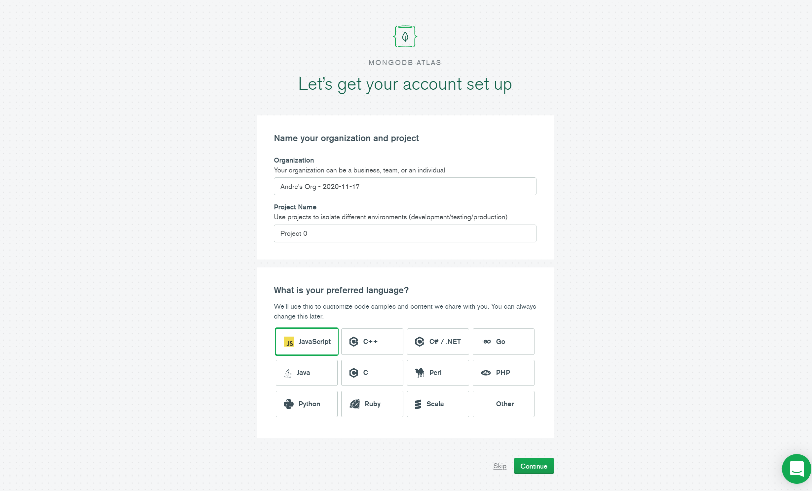
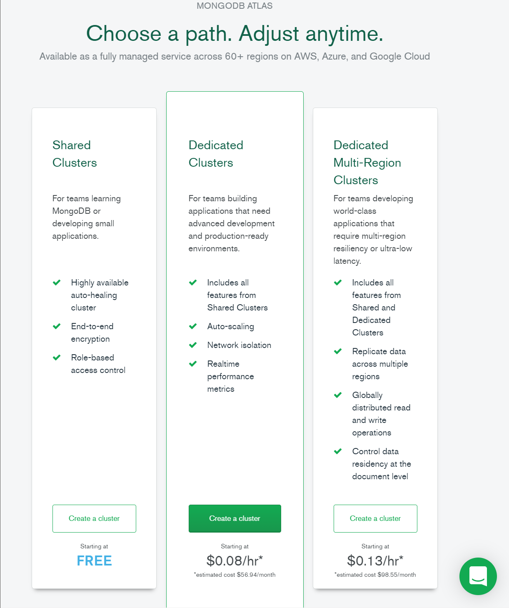
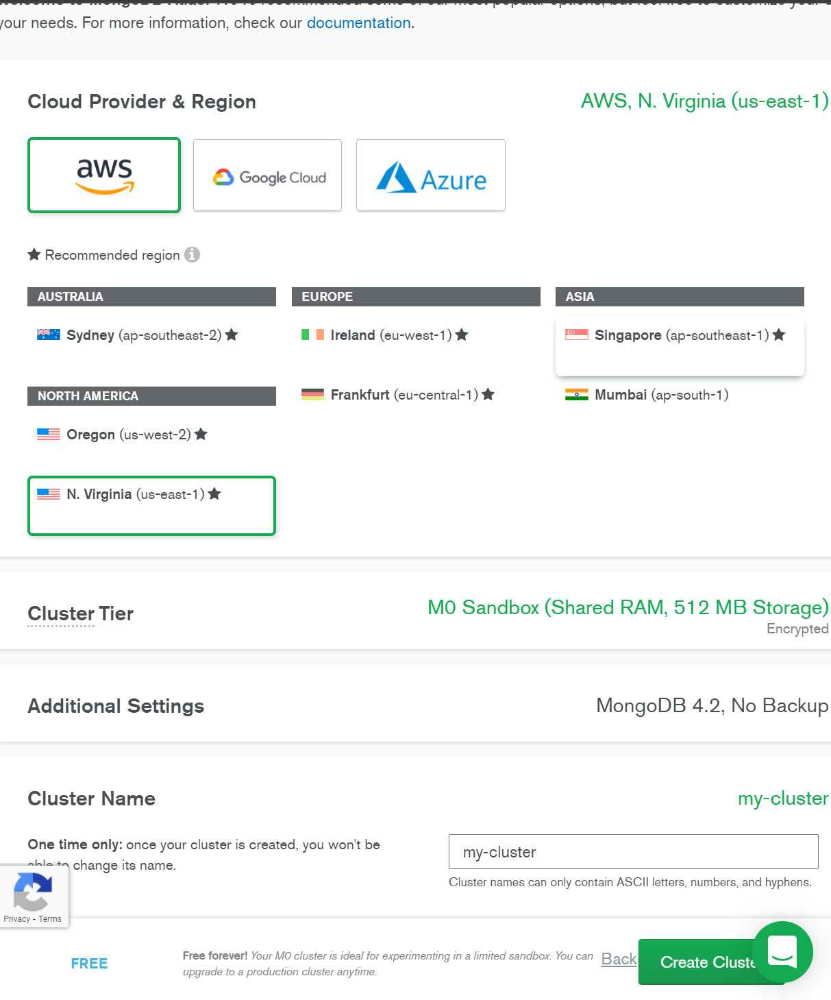
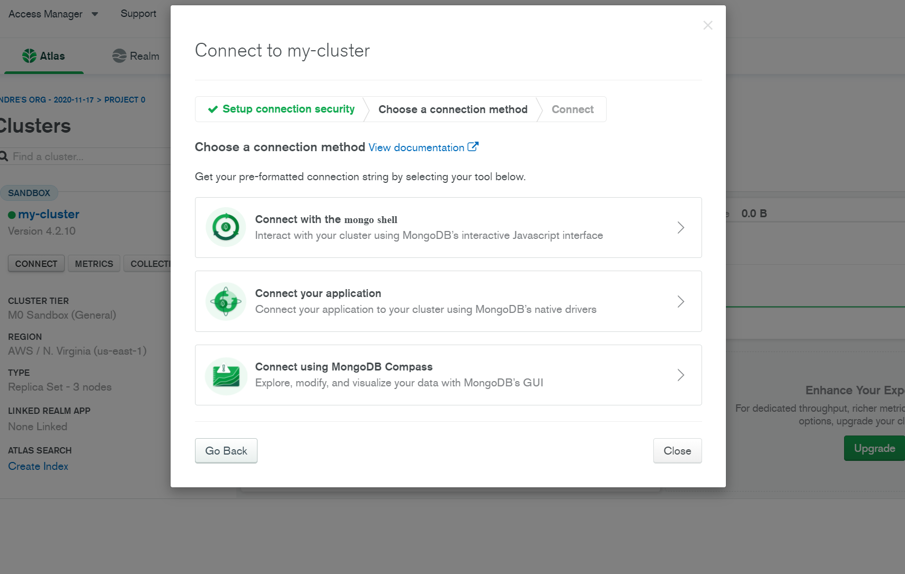
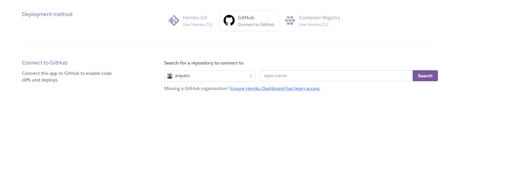

# Mern App Cloud Deployment

### Objectives

- Deploy server to heroku
- Deploy database to MongoDB Atlas
- Deploy react app to either Netlify or Heroku

## Disclaimer

This repo is set up assuming that your apps are stuctured the same way we've done them in class.

## Setting Up Your Atlas Database

Sign up for an Atlas account **[HERE](https://www.mongodb.com/try)**.

Once you've created your account and signed in, set up your account:



- Give Your Organization a name.

- Create a project name.

- Select your preferred language, `javascript` should be your preferred.

When choosing a path, select the free tier.



### Creating A Cluster

Once you've selected a tier, let's set up our cluster/database.



You can leave most of these settings as default, double check that your `Cluster Tier` is `M0 Sandbox`. Give your cluster a name, ideally this should be the name of your database.

You cluster should now be provisioning.


### Creating A Database User

Click on `Database Access` on the left sidebar. Create a new database user.


**Don't lose this password!**

### Database Access Control

Select the `Network Access` option from the left sidebar. And click on `Add IP Address`.


Select `Allow Access From Anyhwere`. Confirm your changes.

### Connecting Your Database

Select the `Clusters` option on the left sidebar and click on `CONNECT` underneath your cluster name.



Select `connect your application`:


Copy the connection url, do not lose this!

## Creating A Heroku Project

Head over to your heroku account and create a new app.

Give your app a name.


Once your app is created select `settings`.

Select `Reveal Config Vars`.

You'll add your environment variables in these fields.

Ex:

- Key:
  `SALT_ROUNDS`

- Value:
  `12`

Add a key called `DATABASE_URL` and set the value to your connection url from Atlas.

Replace `<your password>` and `<dbname>` with the user password for your database and database name respectively, remember these must be an exact match.

### Wiring Up Our Code

We now need to prep our code for deployment.

In your `server.js`:

- > Require path from `path`:
  >
  > ```js
  > const path = require('path')
  > ```

- > Add the following along side your middleware:
  >
  > ```js
  > app.use(express.static(path.join(__dirname, 'client', 'build')))
  > ```
  >
  > **Note: If you are using `helmet` you **must** make this modification:**
  >
  > ```js
  > app.use(helmet({ contentSecurityPolicy: false }))
  > ```

- > Telling Express to serve our react app:
  >
  > **NOTE**: **This should be added after your middleware**
  >
  > ```js
  > app.get('*', (req, res) =>
  >   res.sendFile(path.join(__dirname, 'client', 'build', 'index.html'))
  > )
  > ```

In your `connection.js`:

Add the following to your connection url:

```js
mongoose.connect(
  process.env.NODE_ENV === 'production'
    ? process.env.DATABASE_URL
    : '<Your local db connection>'
)
```

Finally in your `package.json`, add a new script in your `scripts` section:

```json
    "build": "cd client && rm -rf build && npm install && npm run build"
```

## Pointing Client To Our Api

In `client/src/services/apiclient.js`, modify your `baseURL`:

```js
process.env.NODE_ENV === 'production'
  ? `${window.location.origin}/api`
  : '<your local backend server>/api'
```

## Deploying Our Project

In your `Heroku` account select the deploy tab and select `connect to github`. If prompted to sign in go ahead and do so. You should now have a field to search repos:



Search For your project repo and click on `connect`.

You can now set up automatic deploys:


Select `Enable Automatic Deploy` and make sure it's pointing to your `main` branch.

Now in your project folder, `add`, `commit` and `push` your changes and a build should kick off on heroku!

You can monitor progress in heroku's activity tab!

Once the build is finished you can open your app by using the `Open App` button.
